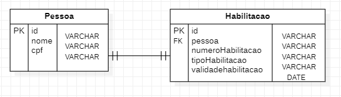
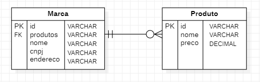
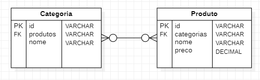

## Disciplina: Projeto Backend, Microsserviços e NoSQL

Exercício 01: Modelo de Entidade e Relacionamento com MongoDB e Spring Boot

-Modelos de dados:

* onetoone-mongobd-example

* onetomany-mongobd-example

* manytomany-mongobd-example

